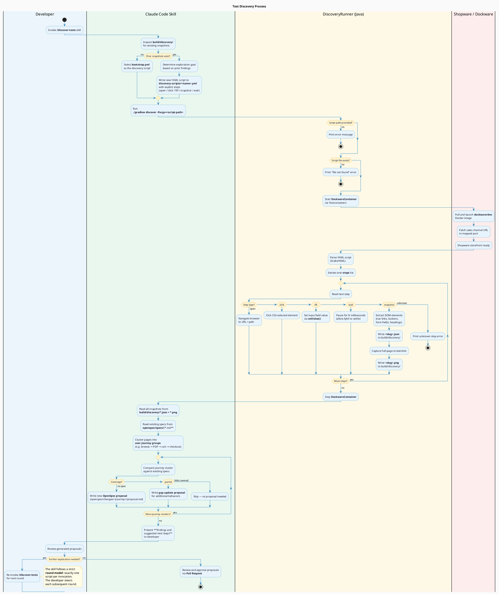

# aiqe-shopware-tests

Browser automation test suite for the [Shopware](https://www.shopware.com/) e-commerce platform, built with **Selenide** and **Serenity BDD**.

## About

This project is part of [Comsysto Reply](https://comsystoreply.de/)'s **AI Quality Engineering (AIQE)** initiative, which explores how AI-assisted tooling can raise the bar for software quality. The repository demonstrates three practices in combination:

- **OpenSpec as plan-mode on steroids** — instead of relying on ad-hoc AI prompting, changes are first specified as structured proposals (design doc + acceptance criteria + task breakdown) in `openspec/changes/`. The AI operates against this spec, keeping implementation grounded and reviewable.
- **Continuous review via Pull Requests** — every generated artifact (code, tests, ADRs, diagrams) goes through a GitHub PR. This creates a tight feedback loop where human reviewers can catch, correct, and rework AI output before it lands, making the process auditable and incremental rather than a one-shot generation.
- **Skills for organisation-wide consistency** — Claude Code skills encode Comsysto's coding guidelines, commit conventions, ADR format, and C4 diagram style. Invoking a skill applies these rules automatically, so the AI's output fits the organization's standards without repeating the same instructions in every prompt.

## Stack

| Library | Version | Role |
|---|---|---|
| Selenide | 7.6.0 | Fluent Selenium wrapper |
| Serenity BDD | 4.2.8 | Test reporting framework |
| JUnit 5 | 5.11.3 | Test runner |
| AssertJ | 3.26.3 | Fluent assertions |
| Testcontainers | 1.20.4 | Manages the Shopware Docker container |

Tests run against a **dockware/dev** Shopware container that is started automatically via Testcontainers — no manual Docker setup required.

## Prerequisites

- Java 17+
- Docker (for the Shopware container)

## Running tests

```bash
# Run all tests
./gradlew test

# Build the project
./gradlew build

# Generate Serenity HTML report
./gradlew aggregate
```

Reports are written to `build/reports/` after each test run (Serenity aggregation runs automatically via the Gradle plugin).

## Discovery

The discovery workflow is a human-in-the-loop pipeline for systematically finding Shopware user journeys that are not yet covered by specs. It combines a scriptable browser crawler with AI-assisted gap analysis to produce OpenSpec proposals ready for human review.

### How it works

The pipeline follows a **round model**: each invocation of the `/discover-tests` skill executes exactly one YAML script, reads the resulting snapshots, and hands findings back to the developer. The developer decides what to explore next and re-invokes the skill for a new round. This keeps the process auditable and prevents autonomous runaway crawls.



### Discovery scripts

Scripts are YAML files in `discovery-scripts/` that drive the browser through a specific flow. Each script contains a `steps` list; the supported step types are:

| Step | Parameter | Description |
|---|---|---|
| `open` | URL or path | Navigate to the given URL. Relative paths are resolved against the Shopware base URL. |
| `click` | CSS selector | Click the matching element. Fails if the element is not found within the Selenide timeout. |
| `fill` | `selector` + `value` | Set a form field's value using Selenide `setValue()`. |
| `snapshot` | `name` + optional `auth_required` | Write `<slug>.json` (URL, title, journey hint, DOM elements) and `<slug>.png` to `build/discovery/`. |
| `wait` | milliseconds | Pause execution to allow AJAX-driven state changes to settle before the next step. |

**Example — minimal storefront snapshot:**

```yaml
steps:
  - open: /
  - snapshot:
      name: homepage
```

**Example — authenticated account page:**

```yaml
steps:
  - open: /account/login
  - fill:
      selector: "input[name='email']"
      value: customer@example.com
  - fill:
      selector: "input[name='password']"
      value: shopware
  - click: "button[type='submit']"
  - wait: 500
  - snapshot:
      name: account-overview
      auth_required: true
```

### Snapshot output

Each `snapshot` step produces two files in `build/discovery/`:

- **`<slug>.json`** — structured data: `url`, `title`, `journey_hint`, `auth_required`, and `elements` (nav links, buttons, form fields, headings extracted from the DOM)
- **`<slug>.png`** — full-page screenshot at 1280 × 800

`build/discovery/` is a build artifact directory and is excluded from version control.

### Running discovery manually

```bash
# First run — use the committed bootstrap script
./gradlew discover -Pargs=discovery-scripts/bootstrap.yml

# Subsequent runs — pass a specific exploration script
./gradlew discover -Pargs=discovery-scripts/explore-cart.yml
```

The `discover` Gradle task is separate from the `test` task: it runs `DiscoveryRunner` directly and never contributes entries to Serenity BDD reports.

> **Note:** The dockware container takes approximately 3 minutes to start on the first run while the Docker image is pulled and Shopware initialises. Subsequent runs reuse the cached image and start faster.

## Architecture

Tests follow the **Page Object Model (POM)** pattern. All sources live under:

```
src/test/java/de/comsystoreply/aiqe/aiqeshopwaretests/
```

| Class | Purpose |
|---|---|
| `DockwareContainer` | Starts/stops the Shopware Testcontainer and patches the sales channel URL |
| `StorefrontPage` | Page object for the Shopware storefront |
| `CartPage` | Page object for the shopping cart |
| `StorefrontSmokeTest` | Smoke tests verifying basic storefront behaviour |
| `CartManagementTest` | Tests covering add / update / remove cart flow |
| `DiscoveryRunner` | Entry point for the scriptable crawler |

## Planning

This project uses [OpenSpec](openspec/config.yaml) for planning and tracking changes. Proposals live in `openspec/changes/`.
