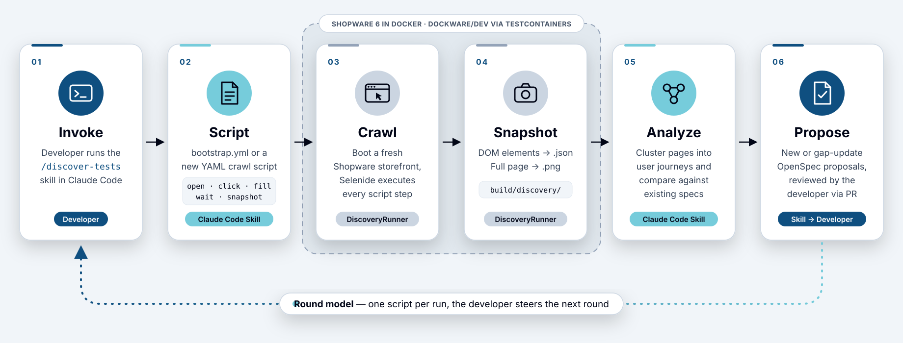

:toc:
:icons: font

= From Understanding to Validation: AI-driven test harness

[.lead]
Building a comprehensive test suite from scratch is weeks of work. In this post, we document how we tackled that challenge for Shopware using Claude Code as a coding partner: setting up a Serenity BDD + Testcontainers framework, writing the first functional tests for the shopping cart, and developing an AI-driven
  discovery pipeline that crawls the live storefront and proposes new test scenarios automatically.

== Introduction
In our https://medium.com/comsystoreply/how-llms-support-product-renovation-a-case-study-b96a069dd26b?sharedUserId=florian.schoenherr[previous post], we explored how coding agents (at that point in time, the very first iterations of Claude and Codex) could help us map and understand the Shopware platform's architecture without any prior experience with it - or its underlying PHP tech stack. We documented modules, extracted requirements, and validated architectural decisions — all critical first steps in a Product Renovation effort. We were both impressed with the agents' abilities and a little disappointed in the overall results, because they were still far from game-changing.

Despite that, we wanted to go forward and decided that a sound understanding of the underlying functional requirements would be a worthy next goal. Since it is long-standing wisdom in software development that comprehensive test suites are the truest and most profound source of functional requirements, we decided to start building one for Shopware.

Creating such a test suite from scratch is an extremely time-consuming effort. Even with containerization technologies making environment setup dramatically easier — we'll be using the ready-made https://hub.docker.com/r/dockware/dev[Dockware] containers that provide complete Shopware instances out of the box — the task of building a comprehensive test framework is considerable. Upfront, architectural decisions need to be made, e.g. which testing framework fits best, how test code is structured for maintainability, what patterns should be followed for page objects and test data management.
Then comes the actual implementation work. For each feature you want to test, you need to:

- Identify and locate the relevant UI elements or API endpoints
- Understand the expected workflows and edge cases
- Write page object classes that encapsulate element selectors and interactions
- Create step definitions that translate business language into code
- Implement test scenarios with proper setup and teardown
- Handle asynchronous behaviors, loading states, and timing issues
- Configure reporting and debugging capabilities

Multiply this by the dozens or hundreds of features in an e-commerce platform, and you're looking at weeks or months of work — even for experienced test automation engineers. For developers less familiar with testing frameworks, the learning curve adds even more time.

We assume, however, that LLM-powered coding agents can help us to dramatically decrease the time required, since today they are already good enough to target the existing software and auto-discover tests and derived sets of requirements.

In this second installment, we're going to document how we built a test framework and automated test discovery with the assistance of a coding agent. Our goal is pragmatic: by the end of this post, we'll have a working test framework using Serenity BDD and Testcontainers, integrated with Dockware containers for instant Shopware environments, plus a small functional test suite validating  capabilities of a core piece of any e-commerce platform, the shopping cart.

This isn't about creating perfect coverage. Instead, we're establishing the foundation: project structure, configuration, patterns, and the first working tests. We'll show what worked well with LLM assistance, where we encountered problems, and how much manual intervention was required to get everything functioning correctly.

More importantly, we're creating the behavioral documentation that will guide our rewrite. Every test we write isn't just validation — it's a specification that says, "This is exactly how Shopware behaves, and our JVM implementation must match this."

Let's get started and see realistically what AI-assisted development brings to the test automation workflow — both its benefits and its limitations.

TIP: As a highly professional piece of open source software, Shopware _has_ a test suite, of course. You can find it at https://github.com/shopware/acceptance-test-suite[shopware/acceptance-test-suite].
 +
However, in this post, we deliberately ignore its existence. We want to prove that coding agents are now at a level of capability that permits us to write tests for _any_ software, facilitating a rewrite using modern technology with the safety net of high test coverage even if there are no tests in the beginning.

We'll be using Claude Code for this effort. Other coding agents would certainly work too, but our experience has shown that for our way of working, it's currently the tooling with the best effort-to-results ratio. That said, it's important to set realistic expectations from the outset.

LLMs can assist with many of the traditionally time-consuming tasks: generating Maven or Gradle configurations with the necessary dependencies, providing templated examples for Serenity configuration files, suggesting CSS selectors for page elements. They excel particularly at generating boilerplate code — the kind of repetitive work that dominates test suite development:

* Page object classes with element locators and interaction methods
* Step definition files with Cucumber annotations and parameter handling
* Test data builders and fixture classes

Once you establish the conventions you want to follow, a coding agent can generate variations of these patterns relatively quickly. When a test fails due to an incorrect selector, the LLM can suggest alternatives. When you need to refactor existing code to follow a different pattern, it can help with the mechanical transformation.

== The Tech Stack
Upfront, we decided on the techstack to be used for testing. Besides Java and JUnit 5, we chose the following two frameworks:

* Serenity BDD
* Testcontainers

=== Serenity BDD
https://serenity-bdd.github.io/[**Serenity BDD**] is a powerful open-source test automation framework that implements BDD principles while providing comprehensive test reporting and living documentation capabilities. Built on top of popular tools like JUnit and Selenium WebDriver, Serenity extends standard BDD frameworks by automatically generating detailed, illustrated test reports that document not just whether tests passed or failed, but the entire story of how the application behaves. Its screenplay pattern promotes writing maintainable, scalable test code by modeling tests around actors, tasks, and abilities rather than page objects, making test scenarios more readable and aligned with user journeys while reducing code duplication and maintenance overhead.

.Behavior-Driven Development (BDD)
****
BDD is a software development methodology that bridges the gap between technical and non-technical stakeholders by expressing system behavior through examples written in natural language. BDD encourages collaboration between developers, testers, and business analysts by defining application features using shared vocabulary, typically structured in "Given-When-Then" format that describes preconditions, actions, and expected outcomes.
****

=== Testcontainers
https://testcontainers.com/[**Testcontainers**] is a Java library that provides lightweight, throwaway instances of databases, message brokers, web browsers, and virtually any other service that can run in a Docker container, specifically designed for integration testing. By leveraging Docker containerization, Testcontainers eliminate the notorious "works on my machine" problem by ensuring that tests run against the exact same environment—whether on a developer's laptop, CI/CD pipeline, or production-like staging system. Instead of relying on mocked dependencies or shared test databases that can cause flaky tests and conflicting state, Testcontainers spins up real, isolated instances of services like PostgreSQL, MongoDB, Kafka, or Redis for each test suite, automatically managing their lifecycle and cleanup.

This approach solves critical environment issues such as version mismatches between development and production databases, configuration drift across testing environments, and the complexity of maintaining long-running test infrastructure. The only prerequisite is having Docker installed and running on the test environment, after which Testcontainers handles container provisioning, port mapping, network configuration, and teardown automatically, enabling developers to write integration tests that are both reliable and representative of real-world behavior without the overhead of manual infrastructure management.

== Our implementation process
For us, this project serves not only as a proof that coding agents can speed up product renovation but also permits us to refine our process for AI-driven Quality Engineering. We use it to share our previous learnings on working with coding agents and also to explore new possibilities.

Coding agents, especially Claude Code, can produce impressing results when given zero-shot prompts. In doing so, however, a human working with it will typically:

* Not quite remember what they asked the agent to do, thereby forgetting the conversational process that was used to produce the code.
* Never read a line of code that was generated by the agent, relying on its capabilities and the observable behavior of the software.
* Not know exactly what the quality of the code is or how it exactly works.

As professional software developers who are held responsible for the products they deliver, we absolutely cannot have this. Therefore, we already established a set of good practices that we apply when working with agents:

. Plan
. Use a sandbox
. Use skills
. Review and verify

=== Plan
At a minimum, we use the agent's built-in planning mode to make sure every requirement leading to the code implemented by the agent is documented somewhere, thus making the process reproducible and the code understandable.

However, Claude's `/plan` mode and its equivalents in other agents are limited. They often rely on a single document (e.g.`CLAUDE.md`, `AGENTS.md`) that serves as a working base but not as documentation for actual requirements.

Because of this, we will use https://openspec.dev/[OpenSpec] in this post. OpenSpec is a set of skills and commands for the most commonly used agent platforms and provides what we consider a `/plan` mode on steroids:

. Start with a _proposal_: This is basically a user story or some other (e.g. technical) change to the existing system. Let the agent help in exploring the different possibilities and come up with a set of requirement specifications and tasks to be executed in the implementation phase. Everthing (proposal, specification, and tasks) is persisted in Markdown documents under `./openspec`.
. Review and rework the requirements and tasks (or ask the agent to rework them) until you are satisfied with them.
. Let the agent implement the tasks in order.
. Verify the implementation and let OpenSpec _archive_ the proposal, thereby merging the new spec with the existing one to keep it up to date.

For more details on SDD (Specification-Driven Development) in general and OpenSpec in particular, please see our https://medium.com/comsystoreply/from-prompts-to-specs-41a283a3bad6[related blog post].

=== Use a sandbox
Agents are dangerous. Depending on the harness and model used, they can misinterpret a user request, take a simple but dangerous path, or simply make errors that pop up from their training data as a good way to solve the presented problem. Because of this, an agent should never (I repeat: _never_) be given free access to a development  environment.
Serious agent harnesses like Claude CLI prevent this by auto-sandboxing. The agent is permitted to read everything, but can access the web or do any kind of operations only with explicit permissions. This default model has two downsides:

1. Being able to read everything on the system permits the agent to scrape important files that may contain secret company documents or credentials. While a professional agent like Claude may guarantee that the data isn't misused, permitting this may still violate regulations and customers' trust.
2. After being asked the tenth time if it's OK to run `gradle` or `curl`, most human beings will start to simply click on 'allow' without really reading what they give permission for, so dangerous actions may still happen with unintended consent.

To avoid these problems, Anthropic has invented a https://code.claude.com/docs/en/sandboxing[sandbox] for its agents.
For the OpenCode agent harness, Comsysto has created its own https://github.com/comsysto/opencode-sandbox[tooling] based on Docker.

Using a sandbox, you can pre-configure what an agent may do (and especially what not) and then allow it free rein in the project directory, thereby dramatically reducing the need to ask for permissions and thus increasing the speed of implementing its tasks.

=== Use skills
Skills were originally invented by Anthropic for Claude Caude but have become an https://agentskills.io/specification[open standard] for all agents.

A skill is an ability and/or set of rules the agent knows to load when (and only when) it is required for a specific task, e.g:

* Where to find important framework documentation.
* How to format Java Code.
* How to execute a specific tool required for the project.

Skills we used extensively in this project:

`openspec-xxx`:: The OpenSpec skills, used for the workflow described in the previous section.
`java-coding-guidelines`:: Instructs the agent how to format  code so that it reads exactly like code we would have written ourselves. Some sample rules are:
* Never use '*'-imports (considered a code smell in Java).
* Use https://jspecify.dev/[JSpecify] annotations for expressing nullability.
* Use `@DisplayName` for clear-text description of generated tests.
`discover-tests`:: This skill is used to discover new tests for the Shopware test suite. It will be discussed later in this post because it is one of its main products.

=== Review and verify
Since we still consider ourselves fully responsible for the code we deliver, all code generated by an agent should be treated like code we wrote ourselves or generated using conventional tooling. Due to that, it is mandatory that every line of code generated is thoroughly reviewed.

In this experimental project, we instructed the agent using OpenSpec rules (similar to agent skills, but not quite the same because the specifically hook into the OpenSpec lifecycle) to follow this process:

1. Using Git, create a long-term feature branch for any proposal it is working on.
2. Create a short-term Git branch from this feature branch for every task. Create a Pull Request on GitHub when finished and let the user review the usually small number of changes. The big advantage of this method is that you can use GitHub's decent review UI and can give feedback in the form of review comments that are understood by the agent, without polluting the code with annotations or tediously formulating verbal references to specific pieces of code.
3. Merge the PR and start on the next task until everything is implemented. Then create another PR for merging the feature branch to the **master** branch.
+
CAUTION: This consolidated PR should be reviewed by another team member, the way we have done it for years. Never forget the agent is a tool and you as a developer are finally responsible for its output!

== The actual project

=== Implementing the test harness

We started simply and old-school: by opening IntelliJ IDEA and let it generate a skeleton project for testing with Serenity BDD. Why spend precious tokens letting Claude do the work when everything is already in place?

This is part of an important lesson we learned: If you can do something using traditional automation scripts or tools, use them! They are faster, cheaper and much more reliable than any coding agent - and they produce always the exact same results!

After generating the skeleton, we created an link:../../openspec/changes/archive/2026-06-24-shopware-storefront-smoke-test/proposal.md[OpenSpec proposal] describing what we wanted. Using the OpenSpec skillset, Claude directly generated a link:../../openspec/changes/archive/2026-06-24-shopware-storefront-smoke-test/design.md[Design Document] and a list of link:../../openspec/changes/archive/2026-06-24-shopware-storefront-smoke-test/tasks.md[implementation tasks].

Applying this change, we soon had a working test framework that could:

* Start Dockware
* Start Selenium and a Chromium Browser
* Look over the storefront page and implement some tests we told it to write

So, are we done already? Did we fulfill our hope the AI is a game changer for implementing UI tests?

You may guess; the answer is a clear NO. The reason is that implementing test is only a part of the game. Tests are only valuable when they cover all code paths, and therefore, to facilitate an actual _rewrite_ of a large legacy software, it must be _complete_. To achieve that completeness, you must actually try the software out, crawl through every functionality and record its behavior in a test case.

What better work could there be for a software agent?

So, we let an agent crawl the UI and discover new test cases. The main difficulty here is that the agent needs to start somewhere and should not cover the same workflow multiple times.

=== Automated test discovery

==== The intent
The idea behind automated discovery is simple: instead of a human deciding what to test next, the agent looks at the running software, figures out which user journeys it offers, compares them to what our specifications already cover, and suggests the missing pieces. Test coverage thereby becomes an observable and repeatable process rather than a matter of someone remembering to write the next test.

We had three requirements from the start:

* **Separate facts from interpretation.** Collecting data about the storefront is deterministic work that belongs in plain Java code. Interpreting that data — which pages form a journey, what is already specified, what is missing — is where an LLM shines. The two should not be mixed.
* **Think in journeys, not pages.** Shopware has many URLs that are merely variations of the same flow (`/clothing` and `/electronics` are both "product listing"). One proposal per URL would bury us in near-duplicates, so the agent has to cluster pages into user journeys.
* **Be re-runnable.** Every run must take the existing specifications into account and propose only gaps or updates, never the same workflow twice.

It took us two iterations to get there.

==== First iteration: a hard-coded crawler
The link:../../openspec/changes/archive/2026-06-25-auto-discover-tests/proposal.md[first proposal] split the work into two parts. A `DiscoveryRunner` class — deliberately a separate Gradle task (`./gradlew discover`) and not a test, since it has no assertions and must not pollute the Serenity reports — reused the existing Testcontainers and Selenide setup. It started a Dockware container, visited the homepage, collected the navigation links, followed each of them one level deep, and finally logged in with the Dockware default customer to visit the account pages. For every page it wrote a JSON snapshot (URL, title, navigation links, buttons, form fields, headings) and a full-page screenshot to `build/discovery/`.

On top of that, a Claude Code skill, `/discover-tests`, ran the crawler, read the snapshots, compared them with the existing specifications under `openspec/specs/`, and wrote one OpenSpec proposal per uncovered journey.

The pipeline worked, but it quickly revealed its blind spot: the crawler could only _follow links_. It never clicked a button, filled in a form or triggered an AJAX request. The shopping cart, the checkout, anything hidden behind a modal dialog or created by client-side state was structurally invisible to it. And every attempt to fix this would have meant adding yet another hard-coded crawl strategy in Java — the runner was trying to be a clever, general-purpose explorer, and it was clearly the wrong place for that intelligence.

==== Second iteration: a scriptable crawler
The link:../../openspec/changes/archive/2026-06-26-scriptable-crawler/proposal.md[second proposal] turned this around: the agent is the intelligence, and the runner becomes a dumb executor. All crawl logic was removed from `DiscoveryRunner` and replaced by a small interpreter for YAML scripts with a deliberately minimal vocabulary:

[source,yaml]
----
steps:
  - open: /account/login
  - fill:
      selector: "input[name='email']"
      value: "customer@example.com"
  - click: "button.btn-primary[type='submit']"
  - wait: 1000
  - snapshot:
      name: account-overview
      auth_required: true
----

There are no loops and no conditionals. If a flow branches, the agent simply writes two scripts. A flat list of steps is easy for a human to review, safe to execute and trivial to parse — and writing explicit sequences like this is exactly what LLMs are good at. Scripts are committed to a `discovery-scripts/` directory, so the repository also records _what_ has been explored and how. The previous hard-coded crawl survives as `bootstrap.yml`, the starting point for a fresh discovery.

The second important change was the _round model_. Instead of running the whole pipeline in one go, each invocation of the skill does exactly one round and then hands back to the developer. This avoids runaway sessions, makes failures easy to debug, and — most importantly — keeps a human in charge of the direction in which the exploration goes.

==== How it works
The following diagram shows one round of the current discovery process:

. *Invoke* — The developer runs `/discover-tests` in Claude Code, optionally naming a journey they want explored.
. *Script* — The skill reads the snapshots and specifications that already exist and decides what to explore next. On a fresh start, it uses `bootstrap.yml`; otherwise, it writes a new, focused script for an uncovered flow, such as adding a product to the cart.
. *Crawl* — `./gradlew discover` boots a fresh Shopware instance in a Dockware container via Testcontainers, and `DiscoveryRunner` executes the script step by step with Selenide.
. *Snapshot* — At every `snapshot` step, the runner writes the page's relevant DOM elements as JSON and a full-page screenshot as PNG to `build/discovery/`.
. *Analyze* — Back in Claude Code, the skill reads the new snapshots, clusters the pages into user journeys and compares them against the existing specifications.
. *Propose* — The developer gets a summary of what was explored, what was found, where the gaps are, and suggestions for the next round. The skill does not create OpenSpec proposals by itself: the developer decides which findings become a new or updated proposal, which then goes through the usual OpenSpec workflow and pull-request review.

The developer then either starts the next round or turns the findings into a proposal — which is exactly how the link:../../openspec/changes/archive/2026-06-26-cart-management/proposal.md[cart management tests] came into being.

